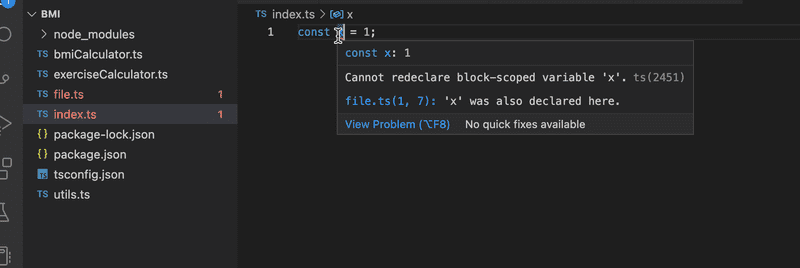

# Exercises 9.1-9.3

setup

Exercises 9.1-9.7. will all be made in the same node project. Create the project in an empty directory with `npm init` and install the ts-node and typescript packages. Also, create the file `tsconfig.json` in the directory with the following content:

```json
{
  "compilerOptions": {
    "noImplicitAny": true
  }
}
```

The compiler option [noImplicitAny](https://www.typescriptlang.org/tsconfig/#noImplicitAny) makes it mandatory to have types for all variables used. This option is currently a default, but it lets us define it explicitly.

## 9.1 Body mass index

Create the code of this exercise in the file `bmiCalculator.ts`.

Write a function calculateBmi that calculates a [BMI](https://en.wikipedia.org/wiki/Body_mass_index) based on a given height (in centimeters) and weight (in kilograms) and then returns a message that suits the results.

Call the function in the same file with hard-coded parameters and print out the result. The code

```ts
console.log(calculateBmi(180, 74));
```

should print the following message:

```bash
Normal range
```

Create an npm script for running the program with the command `npm run calculateBmi`.

## 9.2 Exercise calculator

Create the code of this exercise in file `exerciseCalculator.ts`.

Write a function `calculateExercises` that calculates the average time of `daily exercise hours`, compares it to the `target amount` of daily hours and returns an object that includes the following values:

- the number of days
- the number of training days
- the original target value
- the calculated average time
- boolean value describing if the target was reached
- a rating between the numbers 1-3 that tells how well the hours are met. You can decide on the metric on your own.
- a text value explaining the rating, you can come up with the explanations

The daily exercise hours are given to the function as an [array](https://www.typescriptlang.org/docs/handbook/2/everyday-types.html#arrays) that contains the number of exercise hours for each day in the training period. Eg. a week with 3 hours of training on Monday, none on Tuesday, 2 hours on Wednesday, 4.5 hours on Thursday and so on would be represented by the following array:

```ts
[3, 0, 2, 4.5, 0, 3, 1];
```

For the Result object, you should create an interface.

If you call the function with parameters `[3, 0, 2, 4.5, 0, 3, 1]` and `2`, it should return:

```bash
{
  periodLength: 7,
  trainingDays: 5,
  success: false,
  rating: 2,
  ratingDescription: 'not too bad but could be better',
  target: 2,
  average: 1.9285714285714286
}
```

Create an npm script, `npm run calculateExercises`, to call the function with hard-coded values.

## 9.3 Command line

Change the previous exercises so that you can give the parameters of `bmiCalculator` and `exerciseCalculator` as command-line arguments.

Your program could work eg. as follows:

```bash
$ npm run calculateBmi 180 91

Overweight
```

and:

```bash
$ npm run calculateExercises 2 1 0 2 4.5 0 3 1 0 4

{
  periodLength: 9,
  trainingDays: 6,
  success: false,
  rating: 2,
  ratingDescription: 'not too bad but could be better',
  target: 2,
  average: 1.7222222222222223
}
```

In the example, the `first argument` is the target value.

Handle exceptions and errors appropriately. The `exerciseCalculator` should accept inputs of varied lengths. Determine by yourself how you manage to collect all needed input.

A couple of things to notice:

If you define helper functions in other modules, you should use the [JavaScript module system](https://developer.mozilla.org/en-US/docs/Web/JavaScript/Guide/Modules), that is, the one we have used with React where importing is done with

```ts
import { isNotNumber } from './utils';
```

and exporting

```ts
export const isNotNumber = (argument: any): boolean => isNaN(Number(argument));

export default 'this is the default...';
```

Another note: somehow surprisingly TypeScript does not allow to define the same variable in many files at a "block-scope", that is, outside functions (or classes):



This is actually not quite true. This rule applies only to files that are treated as "scripts". A file is a script if it does not contain any export or import statements. If a file has those, then the file is treated as a [module](https://www.typescriptlang.org/docs/handbook/modules/introduction.html), and the variables do not get defined in the block scope.

## Exercises 9.4-9.5

### 9.4 Express

Add Express to your dependencies and create an HTTP GET endpoint `hello` that answers 'Hello Full Stack!'

The web app should be started with the commands `npm start` in production mode and npm run dev in development mode. The latter should also use `ts-node-dev` to run the app.

Replace also your existing `tsconfig.json` file with the following content:

```json
{
  "compilerOptions": {
    "noImplicitAny": true,
    "noImplicitReturns": true,
    "strictNullChecks": true,
    "strictPropertyInitialization": true,
    "strictBindCallApply": true,
    "noUnusedLocals": true,
    "noUnusedParameters": true,
    "noImplicitThis": true,
    "alwaysStrict": true,
    "esModuleInterop": true,
    "declaration": true
  }
}
```

Make sure there aren't any errors!

### 9.5 WebBMI

Add an endpoint for the BMI calculator that can be used by doing an HTTP GET request to the endpoint bmi and specifying the input with [query string parameters](https://en.wikipedia.org/wiki/Query_string). For example, to get the BMI of a person with a height of 180 and a weight of 72, the URL is <http://localhost:3003/bmi?height=180&weight=72>.

The response is a JSON of the form:

```json
{
  "weight": 72,
  "height": 180,
  "bmi": "Normal range"
}
```

See the [Express documentation](https://expressjs.com/en/5x/api.html#req.query) for info on how to access the query parameters.

If the query parameters of the request are of the wrong type or missing, a response with proper status code and an error message is given:

```json
{
  "error": "malformatted parameters"
}
```

Do not copy the calculator code to file `index.ts`; instead, make it a [TypeScript module](https://www.typescriptlang.org/docs/handbook/modules/introduction.html) that can be imported into `index.ts`.

For `calculateBmi` to work correctly from both the command line and the endpoint, consider adding a check `require.main === module` to the file _bmiCalculator.ts_. It tests whether the module is main, i.e. it is run directly from the command line (in our case, `npm run calculateBmi`), or it is used by other modules that import functions from it (e.g. _index.ts_). Parsing command-line arguments makes sense only if the module is main. Without this condition, you might see argument validation errors when starting the application via `npm start` or `npm run dev`.
