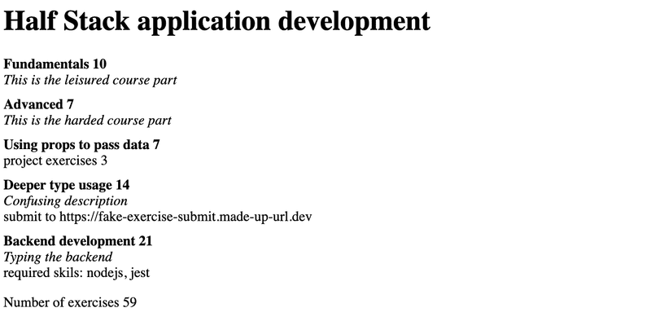

# Exercise 9.15

## 9.15

Create a new Vite app with TypeScript.

This exercise is similar to the one you have already done in [Part 1](https://fullstackopen.com/en/part1/java_script#exercises-1-3-1-5) of the course, but with TypeScript and some extra tweaks. Start off by modifying the contents of main.tsx to the following:

```tsx
import ReactDOM from 'react-dom/client';
import App from './App';

ReactDOM.createRoot(document.getElementById('root')!).render(<App />);
```

and `App.tsx`:

```tsx
const App = () => {
  const courseName = 'Half Stack application development';
  const courseParts = [
    {
      name: 'Fundamentals',
      exerciseCount: 10,
    },
    {
      name: 'Using props to pass data',
      exerciseCount: 7,
    },
    {
      name: 'Deeper type usage',
      exerciseCount: 14,
    },
  ];

  const totalExercises = courseParts.reduce(
    (sum, part) => sum + part.exerciseCount,
    0,
  );

  return (
    <div>
      <h1>{courseName}</h1>
      <p>
        {courseParts[0].name} {courseParts[0].exerciseCount}
      </p>
      <p>
        {courseParts[1].name} {courseParts[1].exerciseCount}
      </p>
      <p>
        {courseParts[2].name} {courseParts[2].exerciseCount}
      </p>
      <p>Number of exercises {totalExercises}</p>
    </div>
  );
};

export default App;
```

and remove the unnecessary files.

The whole app is now in one component. That is not what we want, so refactor the code so that it consists of three components: `Header`, `Content` and `Total`. All data is still kept in the `App` component, which passes all necessary data to each component as props. _Be sure to add type declarations for each component's props!_

The `Header` component should take care of rendering the name of the course. `Content` should render the names of the different parts and the number of exercises in each part, and `Total` should render the total sum of exercises in all parts.

The `App` component should look somewhat like this:

```tsx
const App = () => {
  // const-declarations

  return (
    <div>
      <Header name={courseName} />
      <Content ... />
      <Total ... />
    </div>
  )
};
```

## 9.16

Let us now continue extending the app created in exercise 9.15. First, add the type information and replace the variable `courseParts` with the one from the example below.

```tsx
interface CoursePartBase {
  name: string;
  exerciseCount: number;
}

interface CoursePartBasic extends CoursePartBase {
  description: string;
  kind: 'basic';
}

interface CoursePartGroup extends CoursePartBase {
  groupProjectCount: number;
  kind: 'group';
}

interface CoursePartBackground extends CoursePartBase {
  description: string;
  backgroundMaterial: string;
  kind: 'background';
}

type CoursePart = CoursePartBasic | CoursePartGroup | CoursePartBackground;

const courseParts: CoursePart[] = [
  {
    name: 'Fundamentals',
    exerciseCount: 10,
    description: 'This is an awesome course part',
    kind: 'basic',
  },
  {
    name: 'Using props to pass data',
    exerciseCount: 7,
    groupProjectCount: 3,
    kind: 'group',
  },
  {
    name: 'Basics of type Narrowing',
    exerciseCount: 7,
    description: 'How to go from unknown to string',
    kind: 'basic',
  },
  {
    name: 'Deeper type usage',
    exerciseCount: 14,
    description: 'Confusing description',
    backgroundMaterial:
      'https://type-level-typescript.com/template-literal-types',
    kind: 'background',
  },
  {
    name: 'TypeScript in frontend',
    exerciseCount: 10,
    description: 'a hard part',
    kind: 'basic',
  },
];
```

Now we know that both interfaces `CoursePartBasic` and `CoursePartBackground` share not only the base attributes but also an attribute called `description`, which is a string in both interfaces.

Your first task is to declare a new interface that includes the description attribute and extends the CoursePartBase interface. Then modify the code so that you can remove the description attribute from both CoursePartBasic and CoursePartBackground without getting any errors.

Then create a component `Part` that renders all attributes of each type of course part. Use a switch case-based exhaustive type checking! Use the new component in component `Content`.

Lastly, add another course part interface with the following attributes: name, `exerciseCount`, `description` and `requirements`, the latter being a string array. The objects of this type look like the following:

```tsx
{
  name: "Backend development",
  exerciseCount: 21,
  description: "Typing the backend",
  requirements: ["nodejs", "jest"],
  kind: "special"
}
```

Then add that interface to the type union `CoursePart` and add the corresponding data to the `courseParts` variable. Now, if you have not modified your `Content` component correctly, you should get an error, because you have not yet added support for the fourth course part type. Do the necessary changes to `Content`, so that all attributes for the new course part also get rendered and that the compiler doesn't produce any errors.

The result might look like the following:


