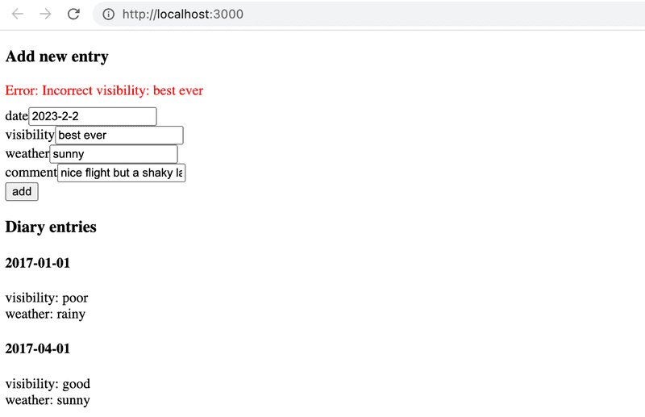
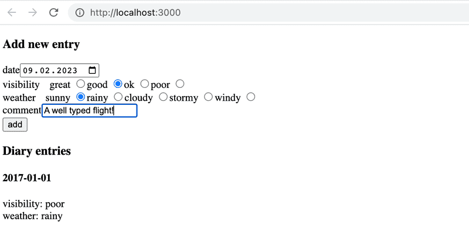

# Exercises 9.17-9.20

Let us now build a frontend for the Ilari's flight diaries that was developed in the [previous section](https://fullstackopen.com/en/part9/typing_an_express_app). The source code of the backend can be found in this [GitHub repository](https://github.com/fullstack-hy2020/flight-diary).

## Exercise 9.17

Create a TypeScript React app with similar configurations as the apps of this section. Fetch the diaries from the backend and render those to screen. Do all the required typing and ensure that there are no Eslint errors.

Remember to keep the network tab open. It might give you a valuable hint...

You can decide how the diary entries are rendered. If you wish, you may take inspiration from the figure below. Note that the backend API does not return the diary comments, you may modify it to return also those on a GET request.

## Exercise 9.18

Make it possible to add new diary entries from the frontend. In this exercise you may skip all validations and assume that the user just enters the data in a correct form.

## Exercise 9.19

Notify the user if the the creation of a diary entry fails in the backend, show also the reason for the failure.

See eg. [this](https://dev.to/mdmostafizurrahaman/handle-axios-error-in-typescript-4mf9) to see how you can narrow the Axios error so that you can get hold of the error message.

Your solution may look like this:

## Exercise 9.20

Addition of a diary entry is now very error prone since user can type anything to the input fields. The situation must be improved.

Modify the input form so that the date is set with a HTML [date](https://developer.mozilla.org/en-US/docs/Web/HTML/Element/input/date) input element, and the weather and visibility are set with HTML [radio buttons](https://developer.mozilla.org/en-US/docs/Web/HTML/Element/input/radio). We have already used radio buttons in [part 6](https://fullstackopen.com/en/part6/many_reducers#store-with-complex-state), that material may or may not be useful...

Your app should all the time stay well typed and there should not be any Eslint errors and no Eslint rules should be ignored.

Your solution could look like this:

