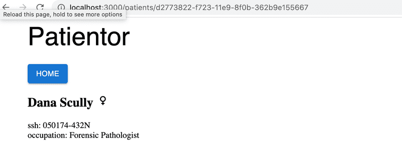
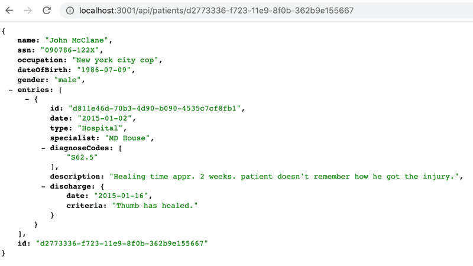
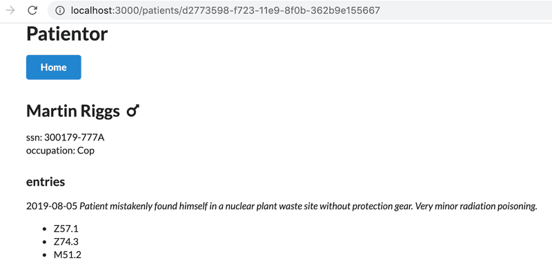
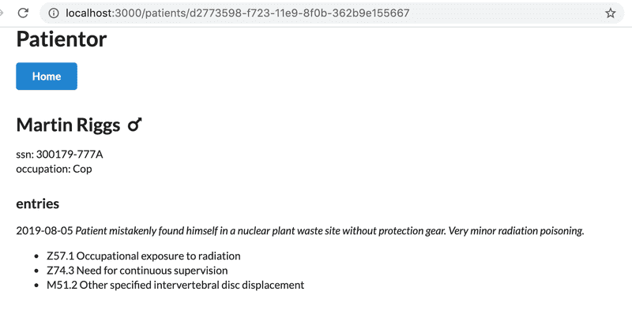
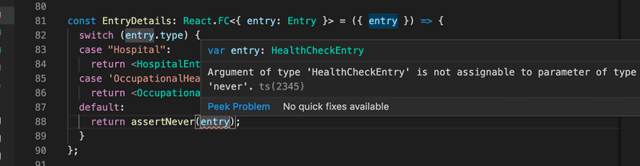
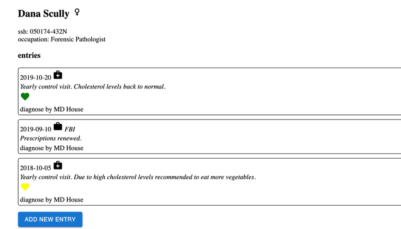

# Exercises 9.8-9.9

## Before you start the exercises

For this set of exercises, you will be developing a backend for an existing project called **Patientor**, which is a simple medical record application for doctors who handle diagnoses and basic health information of their patients.

The [frontend](https://github.com/fullstack-hy2020/patientor) has already been built by outsider experts and your task is to create a backend to support the existing code.

**WARNING**
Quite often VS code loses track of what is really happening in the code and it shows type or style related warnings despite the code having been fixed. If this happens (to me it has happened quite often), close and open the file that is giving you trouble or just restart the editor. It is also good to doublecheck that everything really works by running the compiler and the ESlint from the command line with commands:

```bash
npm run tsc
npm run lint
```

When run in command line you get the "real result" for sure. So, never trust the editor too much!

## 9.8: Patientor backend, step1

Initialize a new backend project that will work with the frontend. Configure ESlint and tsconfig with the same configurations as proposed in the material. Define an endpoint that answers HTTP GET requests for route `/api/ping`.

The project should be runnable with npm scripts, both in development mode and, as compiled code, in production mode.

## 9.9: Patientor backend, step2

Fork and clone the project [patientor](https://github.com/fullstack-hy2020/patientor). Start the project with the help of the README file.

You should be able to use the frontend without a functioning backend.

Ensure that the backend answers the ping request that the frontend has made on startup. Check the developer tools to make sure it works:


You might also want to have a look at the console tab. If something fails, [part 3](https://fullstackopen.com/en/part3) of the course shows how the problem can be solved.

## Exercises 9.10-9.11

Similarly to Ilari's flight service, we do not use a real database in our app but instead use hardcoded data that is in the files [diagnoses.ts](https://github.com/fullstack-hy2020/misc/blob/master/diagnoses.ts) and [patients.ts](https://github.com/fullstack-hy2020/misc/blob/master/patients.ts). Get the files and store those in a directory called `data` in your project. All data modification can be done in runtime memory, so during this part, it is `not necessary to write to a file`.

### 9.10: Patientor backend, step3

Create a type `Diagnosis` and use it to create endpoint `/api/diagnoses` for fetching all diagnoses with HTTP GET.

Structure your code properly by using meaningfully-named directories and files.

**Note** that `diagnoses` may or may not contain the field `latin`. You might want to use [optional properties](https://www.typescriptlang.org/docs/handbook/2/everyday-types.html#optional-properties) in the type definition.

### 9.11: Patientor backend, step4

Create data type `Patient` and set up the GET endpoint `/api/patients` which returns all the patients to the frontend, excluding field `ssn`. Use a [utility type](https://www.typescriptlang.org/docs/handbook/utility-types.html) to make sure you are selecting and returning only the wanted fields.

In this exercise, you may assume that field `gender` has type `string`.

Try the endpoint with your browser and ensure that `ssn` is not included in the response:


After creating the endpoint, ensure that the frontend shows the list of patients:


## Exercises 9.12-9.13

### 9.12: Patientor backend, step5

Create a POST endpoint `/api/patients` for adding patients. Ensure that you can add patients also from the frontend. You can create unique ids of type `string` using the [uuid](https://github.com/uuidjs/uuid) library:

```ts
import { v1 as uuid } from 'uuid';
const id = uuid();
```

### 9.13: Patientor backend, step6

Set up safe parsing, validation and type predicate to the POST /api/patients request.

Refactor the gender field to use an [enum type](http://www.typescriptlang.org/docs/handbook/enums.html).

### 9.14: Patientor backend, step7

Use Zod to validate the requests to the POST endpoint `/api/patients`.

## Exercises 9.21-9.22

We will soon add a new type for our app, `Entry`, which represents a lightweight patient journal entry. It consists of a journal text, i.e. a `description`, a creation date, information regarding the specialist who created it and possible diagnosis codes. Diagnosis codes map to the ICD-10 codes returned from the `/api/diagnoses` endpoint. Our naive implementation will be that a patient has an array of entries.

Before going into this, we need some preparatory work.

### 9.21: Patientor, step1

Create an endpoint `/api/patients/:id` to the backend that returns all of the patient information for one patient, including the array of patient entries that is still empty for all the patients. For the time being, expand the backend types as follows:

```ts
// eslint-disable-next-line @typescript-eslint/no-empty-object-type
export interface Entry {}

export interface Patient {
  id: string;
  name: string;
  ssn: string;
  occupation: string;
  gender: Gender;
  dateOfBirth: string;

  entries: Entry[];
}

export type NonSensitivePatient = Omit<Patient, 'ssn' | 'entries'>;
```

The response should look as follows:


### 9.22: Patientor, step2

Create a page for showing a patient's full information in the frontend.

The user should be able to access a patient's information by clicking the patient's name.

Fetch the data from the endpoint created in the previous exercise.

You may use [MaterialUI](https://mui.com/material-ui/) for the new components but that is up to you since our main focus now is TypeScript.

You might want to have a look at [part 7](https://fullstackopen.com/en/part7/react_router) if you don't yet have a grasp on how the [React Router](https://reactrouter.com/en/main/start/tutorial) works.

The result could look like this:



The example uses [Material UI Icons](https://mui.com/material-ui/material-icons/) to represent genders.

## Exercises 9.23-9.30

Now we are ready to put the finishing touches to the app!

### 9.23: Patientor, step 3

Define the types `OccupationalHealthcareEntry` and `HospitalEntry` so that those conform with the new example data. Ensure that your backend returns the entries properly when you go to an individual patient's route:



Use types properly in the backend! For now, there is no need to do a proper validation for all the fields of the entries in the backend, it is enough e.g. to check that the field `type` has a correct value.

### 9.24: Patientor, step 4

Extend a patient's page in the frontend to list the `date`, `description` and `diagnoseCodes` of the patient's entries.

You can use the same type definition for an `Entry` in the frontend. For these exercises, it is enough to just copy/paste the definitions from the backend to the frontend.

Your solution could look like this:



### 9.25: Patientor, step 5

Fetch and add diagnoses to the application state from the /api/diagnoses endpoint. Use the new diagnosis data to show the descriptions for patient's diagnosis codes:



### 9.26: Patientor, step 6

Extend the entry listing on the patient's page to include the Entry's details, with a new component that shows the rest of the information of the patient's entries, distinguishing different types from each other.

You could use eg. [Icons](https://mui.com/material-ui/material-icons/) or some other [Material UI](https://mui.com/) component to get appropriate visuals for your listing.

You should use a `switch case`-based rendering and `exhaustive type checking` so that no cases can be forgotten.

Like this:



The resulting entries in the listing could look something like this:



### 9.27: Patientor, step 7

We have established that patients can have different kinds of entries. We don't yet have any way of adding entries to patients in our app, so, at the moment, it is pretty useless as an electronic medical record.

Your next task is to add endpoint `/api/patients/:id/entries` to your backend, through which you can POST an entry for a patient.

Remember that we have different kinds of entries in our app, so our backend should support all those types and check that at least all required fields are given for each type.

In this exercise, you quite likely need to remember [this trick](https://fullstackopen.com/en/part9/grande_finale_patientor#omit-with-unions).

You may assume that the diagnostic codes are sent in the correct form and use eg. the following kind of parser to extract those from the request body:

```ts
const parseDiagnosisCodes = (object: unknown): Array<Diagnosis['code']> => {
  if (!object || typeof object !== 'object' || !('diagnosisCodes' in object)) {
    // we will just trust the data to be in correct form
    return [] as Array<Diagnosis['code']>;
  }

  return object.diagnosisCodes as Array<Diagnosis['code']>;
};
```
